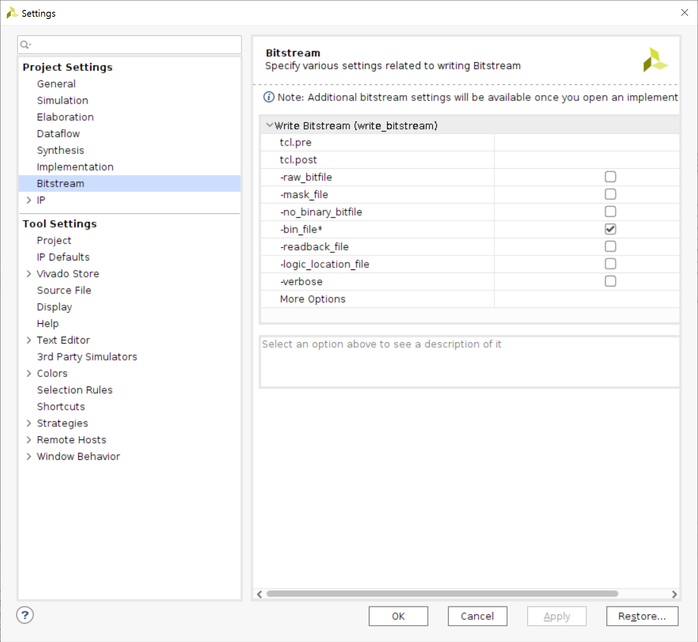
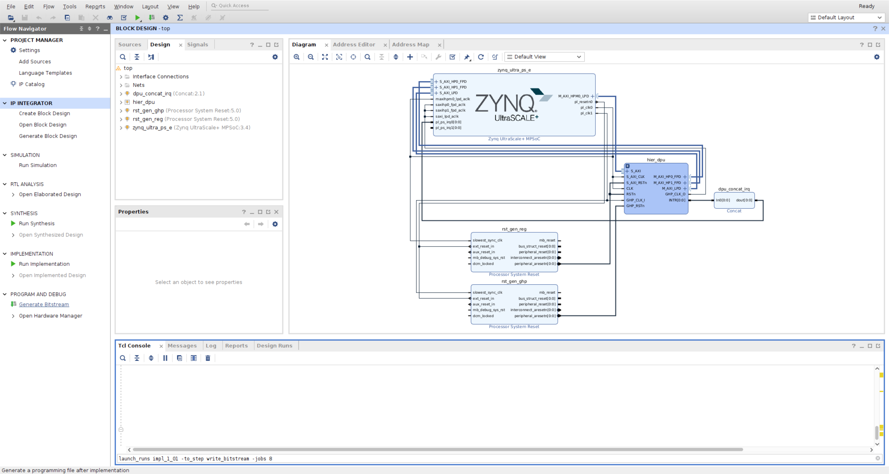

# Vitis-AI 3.5_kv260
<table class="sphinxhide">
 <tr>
   <td align="center"><h1>Vitis AI</h1><h0>Adaptable & Real-Time AI Inference Acceleration</h0>
   </td>
 </tr>
</table>


[](https://opensource.org/licenses/Apache-2.0)

<div align="center">
  
</div>


## Version and Compatibility

As the user must incorporate the IP into the Vivado IP catalog themselves, it is very important to understand that the designs and IP on this page are specific to Vitis AI v3.5 and were verified with Vivado and Vitis 2022.2.  If you are using a different version of Vitis or Vivado, please refer to [IP and Tool Version Compatibility](https://xilinx.github.io/Vitis-AI/3.0/html/docs/reference/version_compatibility.html) for additional information.

"Vitis AI v3.0 is not compatible with Python >= 3.8."

### IP and Tool Version Compatibility
Zynq™ Ultrascale+™

| Vitis AI Release Version | DPUCZDX8G IP Version | Software Tools Version | Linux Kernel Version Tested |
|--------------------------|----------------------|------------------------|-----------------------------|
| v3.5                     | 4.1 (not updated*)   | Vivado / Vitis / PetaLinux 2023.1 | 6.1                         |
| v3.0                     | 4.1                  | Vivado / Vitis / PetaLinux 2022.2 | 5.15                        |
| v2.5                     | 4.0                  | Vivado / Vitis / PetaLinux 2022.1 | 5.15                        |
| v2.0                     | 3.4                  | Vivado / Vitis / PetaLinux 2021.2 | 5.10                        |
| v1.4                     | 3.3                  | Vivado / Vitis / PetaLinux 2021.1 | 5.10                        |
| v1.4                     | 3.3                  | Vivado / Vitis / PetaLinux 2021.1 | 5.10                        |
| v1.3                     | 3.3                  | Vivado / Vitis / PetaLinux 2020.2 | 5.4                         |
| v1.2                     | 3.2                  | Vivado / Vitis / PetaLinux 2020.1 | 5.4                         |
| v1.1                     | 3.2                  | Vivado / Vitis / PetaLinux 2019.2 | 4.19                        |
| v1.0                     | 3.1                  | Vivado / Vitis / PetaLinux 2019.1 | 4.19                        |
| N/A (DNNDK)              | 3.0                  | Vivado / Vitis / PetaLinux 2019.1 | 4.19                        |
| N/A (DNNDK)              | 2.0                  | Vivado / Vitis / PetaLinux 2018.2 | 4.14                        |
| First Release (DNNDK)    | 1.0                  | Vivado / Vitis / PetaLinux 2018.1 | 4.14                        |


<br><br>
## CUDA GPU Host Initial Preparation
If you are leveraging a Vitis AI Docker Image with CUDA-capable GPU acceleration, you must install the NVIDIA Container Toolkit, which enables GPU support inside the Docker container.

For Ubuntu distributions, NVIDIA driver and Container Toolkit installation can generally be accomplished as in the following example (use sudo for non-root users):
```
apt purge nvidia* libnvidia*
apt install nvidia-driver-xxx
apt install nvidia-container-toolkit
```
>**WSL2**
>```
>sudo apt-get update
>sudo apt-get install ca-certificates curl gnupg
>```
> >```
> >distribution=$(. /etc/os-release;echo $ID$VERSION_ID) \
> >&& curl -fsSL https://nvidia.github.io/libnvidia-container/gpgkey \
> >| sudo gpg --dearmor -o /usr/share/keyrings/nvidia-container-toolkit-keyring.gpg \
> >&& curl -s -L https://nvidia.github.io/libnvidia-container/$distribution/libnvidia-container.list | sed 's#deb https://#deb [signed-by=/usr/share/keyrings/nvidia-container-toolkit-keyring.gpg] https://#g' | sudo tee /etc/apt/sources.list.d/nvidia-container-toolkit.list
> >```
>```
>sudo apt-get update
>sudo apt-get install nvidia-container-toolkit
>sudo systemctl restart docker
>```

A simple test to confirm driver installation is to execute `nvidia-smi`. This command can be used as an initial test outside of the Docker environment, and also can be used as a simple test inside of a Docker container following the installation of Docker and the Nvidia Container Toolkit.
>```
>Mon Oct 14 00:54:24 2024
>+---------------------------------------------------------------------------------------+
>| NVIDIA-SMI 535.183.01             Driver Version: 565.90       CUDA Version: 12.7     |
>|-----------------------------------------+----------------------+----------------------+
>| GPU  Name                 Persistence-M | Bus-Id        Disp.A | Volatile Uncorr. ECC |
>| Fan  Temp   Perf          Pwr:Usage/Cap |         Memory-Usage | GPU-Util  Compute M. |
>|                                         |                      |               MIG M. |
>|=========================================+======================+======================|
>|   0  NVIDIA GeForce RTX 3080        On  | 00000000:09:00.0  On |                  N/A |
>|  0%   51C    P8              41W / 370W |   2314MiB / 12288MiB |     30%      Default |
>|                                         |                      |                  N/A |
>+-----------------------------------------+----------------------+----------------------+
>
>+---------------------------------------------------------------------------------------+
>| Processes:                                                                            |
>|  GPU   GI   CI        PID   Type   Process name                            GPU Memory |
>|        ID   ID                                                             Usage      |
>|=======================================================================================|
>|    0   N/A  N/A       559      G   /Xwayland                                 N/A      |
>+---------------------------------------------------------------------------------------+
>```

A simple test to confirm CUDA Version `nvcc --version`.
>```
>nvcc: NVIDIA (R) Cuda compiler driver
>Copyright (c) 2005-2024 NVIDIA Corporation
>Built on Thu_Sep_12_02:18:05_PDT_2024
>Cuda compilation tools, release 12.6, V12.6.77
>Build cuda_12.6.r12.6/compiler.34841621_0
>```


<br><br>
## Docker Install and Verification
Before you install Docker Engine for the first time on a new host machine, you need to set up the Docker repository. Afterward, you can install and update Docker from the repository.
<br>

1. Set up Docker's `apt` repository.
```
# Add Docker's official GPG key:
sudo apt-get update
sudo apt-get install ca-certificates curl
sudo install -m 0755 -d /etc/apt/keyrings
sudo curl -fsSL https://download.docker.com/linux/ubuntu/gpg -o /etc/apt/keyrings/docker.asc
sudo chmod a+r /etc/apt/keyrings/docker.asc

# Add the repository to Apt sources:
echo \
  "deb [arch=$(dpkg --print-architecture) signed-by=/etc/apt/keyrings/docker.asc] https://download.docker.com/linux/ubuntu \
  $(. /etc/os-release && echo "$VERSION_CODENAME") stable" | \
  sudo tee /etc/apt/sources.list.d/docker.list > /dev/null
sudo apt-get update
```
<br>

2. Install the Docker packages.
```
sudo apt-get install docker-ce docker-ce-cli containerd.io docker-buildx-plugin docker-compose-plugin
```
<br>

3. Verify that the Docker Engine installation is successful by running the `hello-world` image.

** [Manage Docker as a non-root user](https://docs.docker.com/engine/install/linux-postinstall/) **
```
docker run hello-world
```
>```
>Unable to find image 'hello-world:latest' locally
>latest: Pulling from library/hello-world
>c1ec31eb5944: Pull complete
>Digest: sha256:d211f485f2dd1dee407a80973c8f129f00d54604d2c90732e8e320e5038a0348
>Status: Downloaded newer image for hello-world:latest
>
>Hello from Docker!
>This message shows that your installation appears to be working correctly.
>
>To generate this message, Docker took the following steps:
> 1. The Docker client contacted the Docker daemon.
> 2. The Docker daemon pulled the "hello-world" image from the Docker Hub.
>    (amd64)
> 3. The Docker daemon created a new container from that image which runs the
>    executable that produces the output you are currently reading.
> 4. The Docker daemon streamed that output to the Docker client, which sent it
>    to your terminal.
>
>To try something more ambitious, you can run an Ubuntu container with:
> $ docker run -it ubuntu bash
>
>Share images, automate workflows, and more with a free Docker ID:
> https://hub.docker.com/
>
>For more examples and ideas, visit:
> https://docs.docker.com/get-started/
>```
```
docker --version
```
>```
>Docker version 27.3.1, build ce12230
>```
<br>

4. Test that Docker has been enabled with CUDA-capable GPU support.
```
docker run --gpus all nvidia/cuda:<cuda version>-cudnn<cudnn version>-runtime-ubuntu<ubuntu version> nvidia-smi
```
>```
>==========
>== CUDA ==
>==========
>
>CUDA Version 12.6.2
>
>Container image Copyright (c) 2016-2023, NVIDIA CORPORATION & AFFILIATES. All rights reserved.
>
>This container image and its contents are governed by the NVIDIA Deep Learning Container License.
>By pulling and using the container, you accept the terms and conditions of this license:
>https://developer.nvidia.com/ngc/nvidia-deep-learning-container-license
>
>A copy of this license is made available in this container at /NGC-DL-CONTAINER-LICENSE for your convenience.
>
>Sun Oct 13 18:19:11 2024
>+-----------------------------------------------------------------------------------------+
>| NVIDIA-SMI 565.51.01              Driver Version: 565.90         CUDA Version: 12.7     |
>|-----------------------------------------+------------------------+----------------------+
>| GPU  Name                 Persistence-M | Bus-Id          Disp.A | Volatile Uncorr. ECC |
>| Fan  Temp   Perf          Pwr:Usage/Cap |           Memory-Usage | GPU-Util  Compute M. |
>|                                         |                        |               MIG M. |
>|=========================================+========================+======================|
>|   0  NVIDIA GeForce RTX 3080        On  |   00000000:09:00.0  On |                  N/A |
>|  0%   50C    P8             40W /  370W |    2345MiB /  12288MiB |     24%      Default |
>|                                         |                        |                  N/A |
>+-----------------------------------------+------------------------+----------------------+
>
>+-----------------------------------------------------------------------------------------+
>| Processes:                                                                              |
>|  GPU   GI   CI        PID   Type   Process name                              GPU Memory |
>|        ID   ID                                                               Usage      |
>|=========================================================================================|
>|    0   N/A  N/A       559      G   /Xwayland                                   N/A      |
>+-----------------------------------------------------------------------------------------+
>```


<br><br>
## Install Vitis-AI
The first step is to clone and follow the install steps for `Vitis AI 3.5` on the host machine.
```
git clone https://github.com/Xilinx/Vitis-AI # when version update, --branch 3.5
cd Vitis-AI
```
[Vitis-AI github](https://github.com/Xilinx/Vitis-AI)


<br><br>
## Build the Docker Container from Xilinx Recipes
This script enables developers to build a container for a specific framework. This single unified script supports CPU-only hosts, GPU-capable hosts, and AMD ROCm-capable hosts.
```
cd <Vitis-AI install path>/Vitis-AI/docker
./docker_build.sh -t <DOCKER_TYPE> -f <FRAMEWORK>
```
#### Vitis AI Docker Container Build Options
|DOCKER_TYPE (-t)|TARGET_FRAMEWORK (-f)|Desired Environment|
|------|---|---|
|cpu|pytorch|PyTorch cpu-only|
||tf2|TensorFlow 2 cpu-only|
||tf1|TensorFlow 1.15 cpu-only|
||||
|gpu|pytorch|PyTorch CUDA-gpu|
||opt_pytorch|PyTorch with AI Optimizer CUDA-gpu|
||tf2|TensorFlow 2 CUDA-gpu|
||tf2|TensorFlow 2 with AI Optimizer CUDA-gpu|
||tf1|TensorFlow 1.15 CUDA-gpu|
||tf1|TensorFlow 1.15 with AI Optimizer CUDA-gpu|
||tf2|tf|
||||
|rocm|pytorch|PyTorch ROCm-gpu|
||opt_pytorch|PyTorch with AI Optimizer ROCm-gpu|
||tf2|TensorFlow 2 ROCm-gpu|
||opt_tf2|TensorFlow 2 with AI Optimizer ROCm-gpu|


<br><br>
## Start the Docker for Vitis AI
```
cd <Vitis-AI install path>/Vitis-AI
./docker_run.sh xilinx/vitis-ai-<pytorch|opt-pytorch|tensorflow2|opt-tensorflow2|tensorflow>-<cpu|gpu|rocm>:latest
```
>```
>==========
>== CUDA ==
>==========
>
>CUDA Version 11.8.0
>
>Container image Copyright (c) 2016-2023, NVIDIA CORPORATION & AFFILIATES. All rights reserved.
>
>This container image and its contents are governed by the NVIDIA Deep Learning Container License.
>By pulling and using the container, you accept the terms and conditions of this license:
>https://developer.nvidia.com/ngc/nvidia-deep-learning-container-license
>
>A copy of this license is made available in this container at /NGC-DL-CONTAINER-LICENSE for your convenience.
>
>Setting up hanaesori 's environment in the Docker container...
>usermod: no changes
>Running as vitis-ai-user with ID 0 and group 0
>
>
>==========================================
>
>__      ___ _   _                   _____
>\ \    / (_) | (_)            /\   |_   _|
> \ \  / / _| |_ _ ___ ______ /  \    | |
>  \ \/ / | | __| / __|______/ /\ \   | |
>   \  /  | | |_| \__ \     / ____ \ _| |_
>    \/   |_|\__|_|___/    /_/    \_\_____|
>
>==========================================
>
>Docker Image Version: 3.5.0.001-1eed93cde   (GPU)
>Vitis AI Git Hash: 1eed93cde
>Build Date: 2024-11-04
>WorkFlow: pytorch
>
>vitis-ai-user@99adb10b6507:/workspace$ 
>```


<br><br>
## Save and Load the Vitis AI Docker image
1. Check the Docker images & container list
```
docker image list
```
>```
>REPOSITORY                         TAG                              IMAGE ID       CREATED         SIZE
>xilinx/vitis-ai-pytorch-gpu        3.5.0.001-1eed93cde              861f2c39dddb   5 hours ago     32.9GB
>xilinx/vitis-ai-gpu-pytorch-base   latest                           f4e73858e7be   6 hours ago     12.2GB
>nvidia/cuda                        12.6.2-cudnn-devel-ubuntu20.04   59abcd54f6af   3 weeks ago     8.11GB
>hello-world                        latest                           d2c94e258dcb   18 months ago   13.3kB
>```
<br>

```
docker ps -a
```
>```
>CONTAINER ID   IMAGE                                             COMMAND                  CREATED          STATUS                      PORTS     NAMES
>8fa95727aadd   xilinx/vitis-ai-pytorch-gpu:3.5.0.001-1eed93cde   "/opt/nvidia/nvidia_…"   2 hours ago      Up 2 hours                            competent_dijkstra
>81ebf59e16a7   nvidia/cuda:12.6.2-cudnn-devel-ubuntu20.04        "/opt/nvidia/nvidia_…"   18 minutes ago   Exited (0) 18 minutes ago             dreamy_antonelli
>8689cc2d2c3d   hello-world                                       "/hello"                 2 weeks ago      Exited (0) 2 weeks ago                friendly_pike
>```
<br>
   
2. Load the Vitis AI Docker image & new container
```
docker run --gpus all --name vitis-ai_3.5 -v <Vitis-AI install path>/Vitis-AI:/workspace -p 8888:8888 -it xilinx/vitis-ai-pytorch-gpu /bin/bash
```
<br>

3. run container
```
docker start vitis-ai_3.5 && docker exec -it vitis-ai_3.5 /bin/bash
```
```
docker ps -a
```
>```
>CONTAINER ID   IMAGE                                        COMMAND                  CREATED             STATUS                  PORTS                                              NAMES
>ca695755579a   vitis-ai_3.5                                 "/opt/nvidia/nvidia_…"   About an hour ago   Up 11 seconds           0.0.0.0:8888->8888/tcp, :::8888->8888/tcp          vitis_ai_3.5
>```


<br><br>
## cross-compiler(PetaLinux) Install

[PetaLinux 2022.2](https://www.xilinx.com/support/download/index.html/content/xilinx/en/downloadNav/embedded-design-tools/archive.html)
```
./petalinux-v2022.2-10141622-installer.run
```

* * *
There is a bit of an issue. System tools are required.
>```
>PetaLinux CMD tools installer version 2022.2
>============================================
>[INFO] Checking free disk space
>[INFO] Checking installed tools
>[ERROR] You are missing the following system tools required by PetaLinux:
>
> - xterm
> - texinfo
> - gcc-multilib
>Please check PetaLinux installation guide - required tools and libraries package section for detailed information
>
>[INFO] Checking installed development libraries
>Please install them with your operating system package manager, and try again
>ERROR: Please install required packages.
>```
* **Solution**
```
sudo apt-get install -y xterm texinfo gcc-multilib

# or

sudo apt-get install -y gcc git make net-tools libncurses5-dev tftpd zlib1g-dev libssl-dev flex
bison libselinux1 gnupg wget diffstat chrpath socat xterm autoconf libtool tar unzip texinfo
```
* * *

>```
>PetaLinux CMD tools installer version 2022.2
>============================================
>[INFO] Checking free disk space
>[INFO] Checking installed tools
>[INFO] Checking installed development libraries
>[INFO] Checking network and other services
>[WARNING] No tftp server found - please refer to "UG1144  PetaLinux Tools Documentation Reference Guide" for its impact and solution
>
>LICENSE AGREEMENTS
>
>PetaLinux SDK contains software from a number of sources.  Please review
>the following licenses and indicate your acceptance of each to continue.
>
>You do not have to accept the licenses, however if you do not then you may
>not use PetaLinux SDK.
>
>Use PgUp/PgDn to navigate the license viewer, and press 'q' to close
>
>Press Enter to display the license agreements
>Do you accept Xilinx End User License Agreement? [y/N] > y
>Do you accept Third Party End User License Agreement? [y/N] > y
>Enter target directory for SDK (default: <user path>/tools): <Xilinx install path>/PetaLinux
>
>```
```
vim ~/.bashrc
```
>```
> source <Xilinx install path>/PetaLinux/<Petalinux version>/tool/settings.sh
>```
```
source ~/.bashrc
```
>```
>*************************************************************************************************************************************************
>The PetaLinux source code and images provided/generated are for demonstration purposes only.
>Please refer to https://xilinx-wiki.atlassian.net/wiki/spaces/A/pages/2741928025/Moving+from+PetaLinux+to+Production+Deployment
> for more details
>*************************************************************************************************************************************************
>PetaLinux environment set to '/home/hanaesori/tools/Xilinx/PetaLinux/2024.1/tool'
>WARNING: /bin/sh is not bash!
>bash is PetaLinux recommended shell. Please set your default shell to bash.
>[INFO] Checking free disk space
>[INFO] Checking installed tools
>[INFO] Checking installed development libraries
>[INFO] Checking network and other services
>[WARNING] No tftp server found - please refer to "UG1144 2024.1 PetaLinux Tools Documentation Reference Guide" for its impact and solution
>```
```
<Vitis-AI install path>/Vitis-AI $  ./docker_run.sh xilinx/vitis-ai-<FRAMEWORK>-<DOCKER_TYPE>:latest
vitis-ai-user@[HOST]:/workspace $ conda activate vitis-ai-pytorch
(vitis-ai-pytorch) vitis-ai-user@[HOST]:/workspace $ cd examples/vai_runtime/resnet50_pt
```
>```
>ls
>```
> *** `resnet50_pt` ***
>```
>rm resnet50_pt
>```
```
(vitis-ai-pytorch) vitis-ai-user@[HOST]:/workspace/examples/vai_runtime/resnet50_pt $ bash -x build.sh
```
>```
>ls
>```
> *** `resnet50_pt` ***


<br><br>
## Vivado(DPU-TRD) Flow
Clone and follow the install steps for Vitis AI 2.0 (to add a project for the TRD flow) on the host machine.
```
git clone --branch 2.0 https://github.com/Xilinx/Vitis-AI
cd Vitis-AI/dsa/DPU-TRD/
```

[DPUCZDX8G_VAI 3.5](https://github.com/user-attachments/files/16415791/VAI-3.5-ZUP-DPU-TRD-main.zip)
```
cp -R VAI-3.5-ZUP-DPU-TRD-main/hw/dpu_ip/DPUCZDX8G_v4_1_0  <DPU TRD>/dpu_ip/
cd prj/Vivado
vim scripts/trd_prj.tcl
```
>```
>dict set dict_prj dict_sys prj_name                 {KV260}
>dict set dict_prj dict_sys prj_part                 {xck26-sfvc784-2LV-c}
>dict set dict_prj dict_sys prj_board                {KV260}
>
>dict set dict_prj dict_param DPU_CLK_MHz            {275}
>dict set dict_prj dict_param DPU_NUM                {1}
>dict set dict_prj dict_param DPU_ARCH               {512}  #It is for faster generation of the project. You can also do 4096(default).
>dict set dict_prj dict_param DPU_SFM_NUM            {0}
>dict set dict_prj dict_param DPU_URAM_PER_DPU       {50}
>
>dict set dict_prj dict_param  HP_CLK_MHz             {274}
>```
```
vim scripts/base/trd_bd.tcl
```
>```
>dict set dict_prj dict_sys ip_dir             [dict get $dict_prj dict_sys srcs_dir]/DPUCZDX8G_v4_1_0
>```
```
vivado -source scripts/trd_prj.tcl &
```


Open Project `PROJECT MANAGER`-`Settings`-`Project Settings`-`Bitstream`-`-bin_file*` setting generate bin file option


Click **Generate Bitstream** or  Type a Tcl command
```
launch_runs impl_1_01 -to_step write_bitstream -jobs 4
```


<br><br>
## PetaLinux(DPU-TRD) Flow
```
cd <DPU TRD>/prj/Vivado/dpu_petalinux_bsp
```
[xilinx-kv260-starterkit-v2022.2-10141622.bsp](https://www.xilinx.com/member/forms/download/xef.html?filename=xilinx-kv260-starterkit-v2022.2-10141622.bsp)
```
petalinux-create -t project -s xilinx-kv260-starterkit-v2022.2-10141622.bsp -n kv260
cd kv260
petalinux-config --get-hw-description=<DPU TRD>/prj/Vivado/prj/ --silentconfig
```

>**Copy the necessary recipes from zcu102 petalinux project**
>```
><DPU-TRD>/prj/Vivado/dpu_petalinux-bsp$ ./download_bsp.sh
><DPU-TRD>/prj/Vivado/dpu_petalinux-bsp$ petalinux-create -t project -s xilinx-zcu102-trd.bsp
>```
>```
>cd <kv260>
>cp -r <DPU-TRD>/prj/Vivado/dpu_petalinux-bsp/xilinx_zcu102_bsp/project-spec/meta-user/recipes-kernel/ ./project-spec/meta-user/
>cp -r <DPU-TRD>/prj/Vivado/dpu_petalinux-bsp/xilinx_zcu102_bsp/project-spec/meta-user/recipes-tools/ ./project-spec/meta-user/
>cp -r <DPU-TRD>/prj/Vivado/dpu_petalinux-bsp/xilinx_zcu102_bsp/project-spec/meta-user/recipes-vitis-ai/ ./project-spec/meta-user/
>cp -r <DPU-TRD>/prj/Vivado/dpu_petalinux-bsp/xilinx_zcu102_bsp/project-spec/meta-user/recipes-apps/ ./project-spec/meta-user/
>```
>**Download kv260/project-spec/`meta-user` and replace old one**
>```
>cd <kv260>
>>cp -r meta-user/recipes-apps/ ./project-spec/meta-user/
>>cp -r meta-user/recipes-vitis-ai/ ./project-spec/meta-user/
>cp -r meta-user/recipes-kernel/ ./project-spec/meta-user/
>cp -r meta-user/recipes-core/ ./project-spec/meta-user/
>```

```
vim project-spec/meta-user/conf/petalinuxbsp.conf
```
>`petalinuxbsp.conf`
>```
>IMAGE_INSTALL:append = " vitis-ai-library "
>IMAGE_INSTALL:append = " vitis-ai-library-dev "
>IMAGE_INSTALL:append = " resnet50 "
>```
```
vim project-spec/meta-user/conf/user-rootfsconfig
```
>`user-rootfsconfig`
>```
>CONFIG_vitis-ai-library
>CONFIG_vitis-ai-library-dev
>CONFIG_vitis-ai-library-dbg
>```

>**To replace old syntax with the new one download kv260/`update_override.sh`**
>```
>cd <kv260>
>chmod +x override.sh
>./update_override.sh
>```

```
petalinux-config
```
> FPGA Manager --><br>
> <*> Fpga Manager<br>
> <br>
> <br>
> Image Packaging Configuration --><br>
> < > Copy final images to tftpboot<br>
> <br>
> <br>
> Image Packaging Configuration --><br>
> Root filesystem type (INITRD) --><br>
> (X) INITRD<br>
> <br>
> Image Packaging Configuration --><br>
> (petalinux-initramfs-image) INITRAMFS/INITRD Image name<br>
> <br>
> petalinux-initramfs-image
```
petalinux-config -c kernel
```
>Device Drivers --><br>
>Misc devices --><br>
><*> Xilinux Deep learning Processing Unit (DPU) Driver
```
petalinux-config -c rootfs
```
> user packages --><br>
> <*> **Select the required packages, Don't select vitis-ai-library-dbg**
> < > vitis-ai-library-dbg
```
petalinux-build

petalinux-package --wic --images-dir images/linux/ --bootfiles "ramdisk.cpio.gz.u-boot,boot.scr,Image,system.dtb,system-zynqmp-sck-kv-g-revB.dtb" --disk-name "sda" --wic-extra-args "-c gzip" --outdir <DPU-TRD>/output/
```
>**WSL2**
>```
>sudo vim /etc/wsl.conf
>```
> >```
> >[boot]
> >systemd=true
> >
> >[interop]
> >appendWindowsPath = false
> >```

Using flash etcher the \<DPU-TRD\>/output/`petalinux-sdimage.wic.gz` onto a SD Card.

### Boot the KV260 with petalinux
login with username petalinux and set a new password


<br><br>
## Creating an Accelerated applications
1. Make a copy of top_wrapper.bin in a different directory and rename it to `kv260.bit.bin`

\<DPU-TRD\>-`prj`-`Vivado`-`prj`-`KV260.runs`-`impl_1_01`-`top_wrapper.bin`

2. Generating the Device Tree Overlay
```
xsct
```
> ```
> createdts -hw <DPU-TRD>/prj/Vivado/prj/top_wrapper.xsa -zocl -platform-name KV260 -git-branch xlnx_rel_v2022.2 -overlay -compile -out <DPU-TRD>/output/dt
> ```
```
dtc -@ -O dtb -o ./output/kv260.dtbo ./output/dt/KV260/psu_cortexa53_0/device_tree_domain/bsp/pl.dtsi
```

3. Create shell.json.
```
cd <output>
echo '{ "shell_type" : "XRT_FLAT", "num_slots": "1" }' > shell.json
```

> 1. `kv260.bit.bin`
> 2. `kv260.dtbo`
> 3. `shell.json`
<br>

```
mkdir myApp
```
Copy `kv260.bit.bin`, `kv260.dtbo`, `shell.json` to `myApp` directory
```
sudo su
sudo mv myApp/ /lib/firmware/xilinx/
sudo xmutil listapps
```
> | Accelerator        | Accel_type | Base            | Base_type | #slots(PL+AIE) | Active_slot |
> |--------------------|------------|-----------------|-----------|----------------|-------------|
> | k26-starter-kits   | XRT_FLAT   | k26-starter-kits| XRT_FLAT  | (0+0)          | 0           |
> | myApp              | XRT_FLAT   | myApp           | XRT_FLAT  | (0+0)          | -1          |

```
sudo xmutil unloadapp
sudo xmutil loadapp myApp
sudo xmutil listapps
```
> | Accelerator        | Accel_type | Base            | Base_type | #slots(PL+AIE) | Active_slot |
> |--------------------|------------|-----------------|-----------|----------------|-------------|
> | k26-starter-kits   | XRT_FLAT   | k26-starter-kits| XRT_FLAT  | (0+0)          | -1          |
> | myApp              | XRT_FLAT   | myApp           | XRT_FLAT  | (0+0)          | 0           |

```
sudo show_dpu
```
> device_core_id=0 device= 0 core = 0 fingerprint = 0x101000056010407 batch = 1 full_cu_name=unknown:dpu0

```
sudo xdputil query
```
>```
>{
>    "DPU IP Spec":{
>        "DPU Core Count":1,
>        "IP version":"v4.1.0",
>        "enable softmax":"False"
>    },
>    "VAI Version":{
>        "libvart-runner.so":"Xilinx vart-runner Version: 3.0.0-c5d2bd43d951c174185d728b8e5bcda3869e0b39  2024-10-19-09:47:04 ",
>        "libvitis_ai_library-dpu_task.so":"Xilinx vitis_ai_library dpu_task Version: 3.0.0-c5d2bd43d951c174185d728b8e5bcda3869e0b39  2023-01-13 06:58:30 [UTC] ",
>        "libxir.so":"Xilinx xir Version: xir-c5d2bd43d951c174185d728b8e5bcda3869e0b39 2024-10-19-09:36:50",
>        "target_factory":"target-factory.3.0.0 c5d2bd43d951c174185d728b8e5bcda3869e0b39"
>    },
>    "kernels":[
>        {
>            "DPU Arch":"DPUCZDX8G_ISA1_B4096",
>            "DPU Frequency (MHz)":275,
>            "XRT Frequency (MHz)":100,
>            "cu_idx":0,
>            "fingerprint":"0x101000056010407",
>            "is_vivado_flow":true,
>            "name":"DPU Core 0"
>        }
>    ]
>}
>```


<br><br>
## Running the TRD Resnet50 Example
```
sudo su
cd ~/app
cp ./model/resnet50.xmodel .
LD_LIBRARY_PATH=samples/lib ./samples/bin/resnet50 img/bellpeppe-994958.JPEG
```
>```
>score[945]  =  0.992235     text: bell pepper,
>score[941]  =  0.00315807   text: acorn squash,
>score[943]  =  0.00191546   text: cucumber, cuke,
>score[939]  =  0.000904801  text: zucchini, courgette,
>score[949]  =  0.00054879   text: strawberry,
>```


<br><br>
## Quantizing the Model PyTorch Version (vai_q_pytorch)
```
cd <Vitis-AI install path>/Vitis-AI/docker
./docker_build.sh -t gpu -f opt_pytorch
cd <Vitis-AI install path>/Vitis-AI
./docker_run.sh xilinx/vitis-ai-opt-pytorch-gpu:latest

conda activate vitis-ai-optimizer_pytorch
## A new Conda environment with a specified PyTorch version (1.2~1.12)  can be created
# cd /workspace/docker/common
# replace_pytorch.sh new_conda_env_name

cd /workspace/src/vai_quantizer/vai_q_pytorch
export CUDA_HOME=/usr/local/cuda
## For the CPU version, remove all CUDA_HOME environment variable setting in your .bashrc
# unset CUDA_HOME
```
>```
> vim requirements.txt
>```
> > scikit-learn
> > scipy==1.3.1
> > numpy==1.17.2
> > tqdm
> > ninja
> > six
> > tabulate==0.8.9 
> > graphviz==0.19.1
> > PyYAML==6.0
> > networkx==2.5.1
```
find /usr -name "libffi.so*"

sudo ln -s /usr/lib/x86_64-linux-gnu/libffi.so.<version> /usr/lib/x86_64-linux-gnu/libffi.so.6
pip install sklearn --use-deprecated=legacy-resolver
pip install -r requirements.txt
cd ./pytorch_binding
python setup.py install
```
> > `[host]` **Not Docker Container**
> > ```
> > docker run --gpus all nvidia/cuda:<cuda version>-cudnn<cudnn version>-runtime-ubuntu<ubuntu version>
> > ```
```
sudo apt install nvidia-cuda-toolkit
```
Verify the installation.
```
python -c "import pytorch_nndct"
```


> ### ReLU Type
> 
> The ReLU Type option determines the specific ReLU activation functions that can be used with the DPUCZDX8G. ReLU and ReLU6 are supported by default. Selection of the option “ReLU + LeakyReLU + ReLU6“ will enable LeakyReLU as an activation function.
> 
>  ** Note: For this implementation, the LeakyReLU coefficient is fixed to 0.1 which is approximated as 26/256 = 0.1015625
```
node name                                                                       op Type           hardware constraints
------------------------------------------------------------------------------  ----------------  -------------------------------------------------------------------------------------------------------------------------------------------------------------------------------------------------------------
ToyModel::ToyModel/LeakyReLU[relu]/ret.7                                        nndct_leaky_relu  xir::Op{name = ToyModel__ToyModel_Conv2d_conv__ret_5, type = conv2d-fix} has been assigned to CPU: [DPU does not support activation type: LEAKYRELU. Its alpha is 0.100000, but DPU only support 0.1015625.].```
```


<br><br><br>
* * *
## Reference

[Install Docker Engine on Ubuntu](https://docs.docker.com/engine/install/ubuntu/#install-using-the-repository)

[Vitis AI 3.0](https://xilinx.github.io/Vitis-AI/3.0/html/index.html)

[Vitis AI 3.0 github](https://github.com/Xilinx/Vitis-AI/tree/3.0)

[Vitis-AI Tutorials github](https://github.com/Xilinx/Vitis-AI-Tutorials/tree/3.0)

[KV260 DPU-TRD Petalinux 2022.1 Vivado Flow](https://www.hackster.io/shreyasnr/kv260-dpu-trd-petalinux-2022-1-vivado-flow-000c0b?f=1)
* * *
* * *
