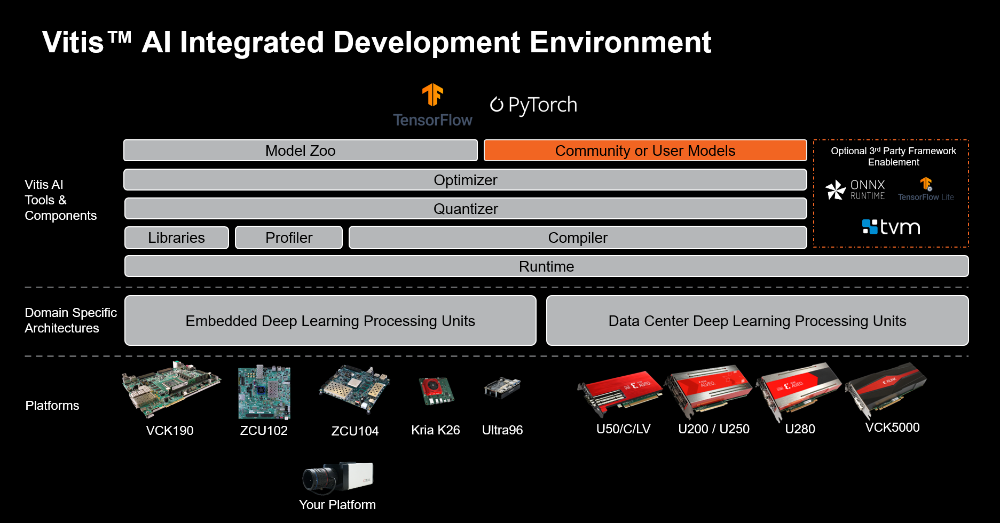

# Vitis-AI 3.0_kv260
<table class="sphinxhide">
 <tr>
   <td align="center"><h1>Vitis AI</h1><h0>Adaptable & Real-Time AI Inference Acceleration</h0>
   </td>
 </tr>
</table>


[](https://opensource.org/licenses/Apache-2.0)

<div align="center">
  
</div>
<br />


## CUDA GPU Host Initial Preparation
If you are leveraging a Vitis AI Docker Image with CUDA-capable GPU acceleration, you must install the NVIDIA Container Toolkit, which enables GPU support inside the Docker container.

For Ubuntu distributions, NVIDIA driver and Container Toolkit installation can generally be accomplished as in the following example (use sudo for non-root users):
```
apt purge nvidia* libnvidia*
apt install nvidia-driver-xxx
apt install nvidia-container-toolkit
```
>**WSL2**
>```
>sudo apt-get update
>sudo apt-get install ca-certificates curl gnupg
>```
> >```
> >distribution=$(. /etc/os-release;echo $ID$VERSION_ID) \
> >&& curl -fsSL https://nvidia.github.io/libnvidia-container/gpgkey \
> >| sudo gpg --dearmor -o /usr/share/keyrings/nvidia-container-toolkit-keyring.gpg \
> >&& curl -s -L https://nvidia.github.io/libnvidia-container/$distribution/libnvidia-container.list | sed 's#deb https://#deb [signed-by=/usr/share/keyrings/nvidia-container-toolkit-keyring.gpg] https://#g' | sudo tee /etc/apt/sources.list.d/nvidia-container-toolkit.list
> >```
>```
>sudo apt-get update
>sudo apt-get install nvidia-container-toolkit
>sudo systemctl restart docker
>```

A simple test to confirm driver installation is to execute `nvidia-smi`. This command can be used as an initial test outside of the Docker environment, and also can be used as a simple test inside of a Docker container following the installation of Docker and the Nvidia Container Toolkit.
>```
>Mon Oct 14 00:54:24 2024
>+---------------------------------------------------------------------------------------+
>| NVIDIA-SMI 535.183.01             Driver Version: 565.90       CUDA Version: 12.7     |
>|-----------------------------------------+----------------------+----------------------+
>| GPU  Name                 Persistence-M | Bus-Id        Disp.A | Volatile Uncorr. ECC |
>| Fan  Temp   Perf          Pwr:Usage/Cap |         Memory-Usage | GPU-Util  Compute M. |
>|                                         |                      |               MIG M. |
>|=========================================+======================+======================|
>|   0  NVIDIA GeForce RTX 3080        On  | 00000000:09:00.0  On |                  N/A |
>|  0%   51C    P8              41W / 370W |   2314MiB / 12288MiB |     30%      Default |
>|                                         |                      |                  N/A |
>+-----------------------------------------+----------------------+----------------------+
>
>+---------------------------------------------------------------------------------------+
>| Processes:                                                                            |
>|  GPU   GI   CI        PID   Type   Process name                            GPU Memory |
>|        ID   ID                                                             Usage      |
>|=======================================================================================|
>|    0   N/A  N/A       559      G   /Xwayland                                 N/A      |
>+---------------------------------------------------------------------------------------+
>```


## Docker Install and Verification
Before you install Docker Engine for the first time on a new host machine, you need to set up the Docker repository. Afterward, you can install and update Docker from the repository.
1. Set up Docker's `apt` repository.
```
# Add Docker's official GPG key:
sudo apt-get update
sudo apt-get install ca-certificates curl
sudo install -m 0755 -d /etc/apt/keyrings
sudo curl -fsSL https://download.docker.com/linux/ubuntu/gpg -o /etc/apt/keyrings/docker.asc
sudo chmod a+r /etc/apt/keyrings/docker.asc

# Add the repository to Apt sources:
echo \
  "deb [arch=$(dpkg --print-architecture) signed-by=/etc/apt/keyrings/docker.asc] https://download.docker.com/linux/ubuntu \
  $(. /etc/os-release && echo "$VERSION_CODENAME") stable" | \
  sudo tee /etc/apt/sources.list.d/docker.list > /dev/null
sudo apt-get update
```
2. Install the Docker packages.
```
sudo apt-get install docker-ce docker-ce-cli containerd.io docker-buildx-plugin docker-compose-plugin
```
3. Verify that the Docker Engine installation is successful by running the `hello-world` image.
```
sudo docker run hello-world
```
>```
>Unable to find image 'hello-world:latest' locally
>latest: Pulling from library/hello-world
>c1ec31eb5944: Pull complete
>Digest: sha256:d211f485f2dd1dee407a80973c8f129f00d54604d2c90732e8e320e5038a0348
>Status: Downloaded newer image for hello-world:latest
>
>Hello from Docker!
>This message shows that your installation appears to be working correctly.
>
>To generate this message, Docker took the following steps:
> 1. The Docker client contacted the Docker daemon.
> 2. The Docker daemon pulled the "hello-world" image from the Docker Hub.
>    (amd64)
> 3. The Docker daemon created a new container from that image which runs the
>    executable that produces the output you are currently reading.
> 4. The Docker daemon streamed that output to the Docker client, which sent it
>    to your terminal.
>
>To try something more ambitious, you can run an Ubuntu container with:
> $ docker run -it ubuntu bash
>
>Share images, automate workflows, and more with a free Docker ID:
> https://hub.docker.com/
>
>For more examples and ideas, visit:
> https://docs.docker.com/get-started/
>```
```
docker --version
```
>```
>Docker version 27.3.1, build ce12230
>```


## Install Vitis-AI
The first step is to clone and follow the install steps for `Vitis AI 3.0`(**not 3.5**) on the host machine.
```
git clone --branch 3.0 https://github.com/Xilinx/Vitis-AI
cd Vitis-AI
```
[Vitis-AI github](https://github.com/Xilinx/Vitis-AI)
## Build the Docker Container from Xilinx Recipes
This script enables developers to build a container for a specific framework. This single unified script supports CPU-only hosts, GPU-capable hosts, and AMD ROCm-capable hosts.
* The Docker daemon always runs as the `root` user. 
```
cd <Vitis-AI install path>/Vitis-AI/docker
sudo ./docker_build.sh -t <DOCKER_TYPE> -f <FRAMEWORK>
```
#### Vitis AI Docker Container Build Options
|DOCKER_TYPE (-t)|TARGET_FRAMEWORK (-f)|Desired Environment|
|------|---|---|
|cpu|pytorch|PyTorch cpu-only|
||tf2|TensorFlow 2 cpu-only|
||tf1|TensorFlow 1.15 cpu-only|
||||
|gpu|pytorch|PyTorch CUDA-gpu|
||opt_pytorch|PyTorch with AI Optimizer CUDA-gpu|
||tf2|TensorFlow 2 CUDA-gpu|
||tf2|TensorFlow 2 with AI Optimizer CUDA-gpu|
||tf1|TensorFlow 1.15 CUDA-gpu|
||tf1|TensorFlow 1.15 with AI Optimizer CUDA-gpu|

||tf2|tf|
||||
|rocm|pytorch|PyTorch ROCm-gpu|
||opt_pytorch|PyTorch with AI Optimizer ROCm-gpu|
||tf2|TensorFlow 2 ROCm-gpu|
||opt_tf2|TensorFlow 2 with AI Optimizer ROCm-gpu|


```
docker run --gpus all nvidia/cuda:11.3.1-cudnn8-runtime-ubuntu20.04 nvidia-smi
```
>```
>==========
>== CUDA ==
>==========
>
>CUDA Version 11.3.1
>
>Container image Copyright (c) 2016-2023, NVIDIA CORPORATION & AFFILIATES. All rights reserved.
>
>This container image and its contents are governed by the NVIDIA Deep Learning Container License.
>By pulling and using the container, you accept the terms and conditions of this license:
>https://developer.nvidia.com/ngc/nvidia-deep-learning-container-license
>
>A copy of this license is made available in this container at /NGC-DL-CONTAINER-LICENSE for your convenience.
>
>Sun Oct 13 18:19:11 2024
>+-----------------------------------------------------------------------------------------+
>| NVIDIA-SMI 565.51.01              Driver Version: 565.90         CUDA Version: 12.7     |
>|-----------------------------------------+------------------------+----------------------+
>| GPU  Name                 Persistence-M | Bus-Id          Disp.A | Volatile Uncorr. ECC |
>| Fan  Temp   Perf          Pwr:Usage/Cap |           Memory-Usage | GPU-Util  Compute M. |
>|                                         |                        |               MIG M. |
>|=========================================+========================+======================|
>|   0  NVIDIA GeForce RTX 3080        On  |   00000000:09:00.0  On |                  N/A |
>|  0%   50C    P8             40W /  370W |    2345MiB /  12288MiB |     24%      Default |
>|                                         |                        |                  N/A |
>+-----------------------------------------+------------------------+----------------------+
>
>+-----------------------------------------------------------------------------------------+
>| Processes:                                                                              |
>|  GPU   GI   CI        PID   Type   Process name                              GPU Memory |
>|        ID   ID                                                               Usage      |
>|=========================================================================================|
>|    0   N/A  N/A       559      G   /Xwayland                                   N/A      |
>+-----------------------------------------------------------------------------------------+
>```


## Start the Docker for Vitis AI
```
cd <Vitis-AI install path>/Vitis-AI
./docker_run.sh xilinx/vitis-ai-<pytorch|opt-pytorch|tensorflow2|opt-tensorflow2|tensorflow>-<cpu|gpu|rocm>:latest
```
>```
>==========
>== CUDA ==
>==========
>
>CUDA Version 11.3.1
>
>Container image Copyright (c) 2016-2023, NVIDIA CORPORATION & AFFILIATES. All rights reserved.
>
>This container image and its contents are governed by the NVIDIA Deep Learning Container License.
>By pulling and using the container, you accept the terms and conditions of this license:
>https://developer.nvidia.com/ngc/nvidia-deep-learning-container-license
>
>A copy of this license is made available in this container at /NGC-DL-CONTAINER-LICENSE for your convenience.
>
>Setting up root 's environment in the Docker container...
> WARNING: You are running Vitis AI Docker container as root.
>For security reasons, consider running as a regular user:
>    $ sh docker_run.sh
>
>OR
>
>    $ docker run -e UID=$(id -u) -e GID=$(id -g) args...
>
>You will be running as vitis-ai-user with non-root UID/GID in Vitis AI Docker container.
>
>
>==========================================
>
>__      ___ _   _                   _____
>\ \    / (_) | (_)            /\   |_   _|
> \ \  / / _| |_ _ ___ ______ /  \    | |
>  \ \/ / | | __| / __|______/ /\ \   | |
>   \  /  | | |_| \__ \     / ____ \ _| |_
>    \/   |_|\__|_|___/    /_/    \_\_____|
>
>==========================================
>
>Docker Image Version: 3.0.0.001   (GPU)
>Vitis AI Git Hash: 091f75041
>Build Date: 2024-10-14
>WorkFlow: pytorch
>```


## Start the Docker for Vitis AI
### cross-compiler(PetaLinux) Install
[PetaLinux 2024.1](https://www.xilinx.com/support/download/index.html/content/xilinx/en/downloadNav/embedded-design-tools.html)
```
./petalinux-v2024.1-05202009-installer.run
```

* * *
There is a bit of an issue. System tools are required.
>```
>PetaLinux CMD tools installer version 2024.1
>============================================
>[INFO] Checking free disk space
>[INFO] Checking installed tools
>[ERROR] You are missing the following system tools required by PetaLinux:
>
> - xterm
> - texinfo
> - gcc-multilib
>Please check PetaLinux installation guide - required tools and libraries package section for detailed information
>
>[INFO] Checking installed development libraries
>Please install them with your operating system package manager, and try again
>ERROR: Please install required packages.
>```
* **Solution**
```
sudo apt-get install -y xterm texinfo gcc-multilib

# or

sudo apt-get install -y gcc git make net-tools libncurses5-dev tftpd zlib1g-dev libssl-dev flex
bison libselinux1 gnupg wget diffstat chrpath socat xterm autoconf libtool tar unzip texinfo
```
* * *

>```
>PetaLinux CMD tools installer version 2024.1
>============================================
>[INFO] Checking free disk space
>[INFO] Checking installed tools
>[INFO] Checking installed development libraries
>[INFO] Checking network and other services
>[WARNING] No tftp server found - please refer to "UG1144  PetaLinux Tools Documentation Reference Guide" for its impact and solution
>
>LICENSE AGREEMENTS
>
>PetaLinux SDK contains software from a number of sources.  Please review
>the following licenses and indicate your acceptance of each to continue.
>
>You do not have to accept the licenses, however if you do not then you may
>not use PetaLinux SDK.
>
>Use PgUp/PgDn to navigate the license viewer, and press 'q' to close
>
>Press Enter to display the license agreements
>Do you accept Xilinx End User License Agreement? [y/N] > y
>Do you accept Third Party End User License Agreement? [y/N] > y
>Enter target directory for SDK (default: /$ user path $/tools): /$ Xilinx path = /tools/Xilinx/ $/PetaLinux
>
>```
```
vim ~/.bashrc
```
>```
> source /$ Xilinx path $/PetaLinux/tool/settings.sh
>```
```
source ~/.bashrc
```
>```
>*************************************************************************************************************************************************
>The PetaLinux source code and images provided/generated are for demonstration purposes only.
>Please refer to https://xilinx-wiki.atlassian.net/wiki/spaces/A/pages/2741928025/Moving+from+PetaLinux+to+Production+Deployment
> for more details
>*************************************************************************************************************************************************
>PetaLinux environment set to '/home/hanaesori/tools/Xilinx/PetaLinux/2024.1/tool'
>WARNING: /bin/sh is not bash!
>bash is PetaLinux recommended shell. Please set your default shell to bash.
>[INFO] Checking free disk space
>[INFO] Checking installed tools
>[INFO] Checking installed development libraries
>[INFO] Checking network and other services
>[WARNING] No tftp server found - please refer to "UG1144 2024.1 PetaLinux Tools Documentation Reference Guide" for its impact and solution
>```
```
<Vitis-AI install path>/Vitis-AI $  ./docker_run.sh xilinx/vitis-ai-<FRAMEWORK>-<DOCKER_TYPE>:latest
vitis-ai-user@[HOST]:/workspace $ conda activate vitis-ai-pytorch
(vitis-ai-pytorch) vitis-ai-user@[HOST]:/workspace $ cd examples/vai_runtime/resnet50_pt
```
>```
>ls
>```
> *** `resnet50_pt` ***
>```
>rm resnet50_pt
>```
```
(vitis-ai-pytorch) vitis-ai-user@[HOST]:/workspace/examples/vai_runtime/resnet50_pt $ bash -x build.sh
```
>```
>ls
>```
> *** `resnet50_pt` ***


* * *
## Reference

[Install Docker Engine on Ubuntu](https://docs.docker.com/engine/install/ubuntu/#install-using-the-repository)

[Vitis AI 3.0](https://xilinx.github.io/Vitis-AI/3.0/html/index.html)

[Vitis AI 3.0 github](https://github.com/Xilinx/Vitis-AI/tree/3.0)

[Vitis-AI Tutorials github](https://github.com/Xilinx/Vitis-AI-Tutorials/tree/3.0)

* * *
* * *
